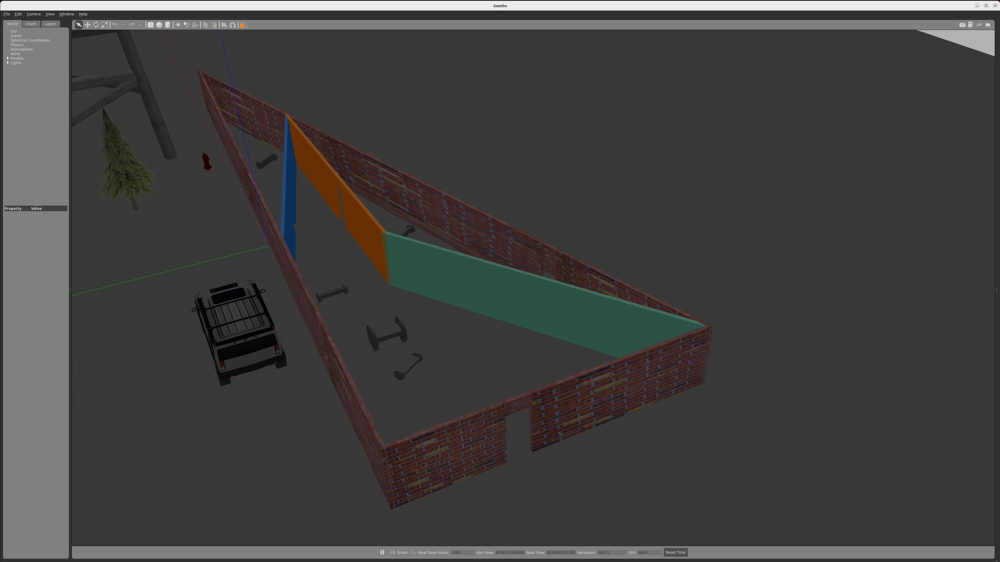

[](https://www.udacity.com/robotics)

# RoboND-myrobot
In this first project in the Udacity Robotics Software Engineer Nanodegree Program I have built a two-wheeled robot model with the Model Editor tool in Gazebo. 
Included in this model made in Gazebo World I have also added:

Structure is different than the one shown in the sample simulation world.
Single floor.
Enough space for robots to navigate.
Several features.
Several colors.
And, finally write a plugin.  

### Directory Structure
```
    .myrobot                           # myrobot lab main folder 
    ├── images                         # Code output image                   
    │   ├── output.png
    ├── model                          # Model files of the two-wheeled robot
    │   ├── robot
    │   │   ├── model.config
    │   │   ├── model.sdf
    │   ├── BigRobot                   # Model Made by Me.
    │   │   ├── model.config
    │   │   ├── model.sdf
    ├── script                         # Gazebo World plugin C++ script      
    │   ├── hello.cpp
    ├── world                          # Gazebo main World empty scene
    │   ├── myworld
    ├── CMakeLists.txt                 # Link libraries 
    └──                              
```

### Steps to launch the simulation

#### Step 1 Update and upgrade the Workspace image
```sh
$ sudo apt-get update
$ sudo apt-get upgrade -y
```

#### Step 2 Clone the lab folder in /home/workspace/
```sh
$ cd /home/workspace/
$ git clone https://github.com/udacity/RoboND-myrobot myrobot
```

#### Step 3 Compile the code
```sh
$ cd /home/workspace/myrobot/
$ mkdir build
$ cd build/
$ cmake ../
$ make
```

#### Step 4 Add the library path to the Gazebo plugin path  
```sh
$ export GAZEBO_PLUGIN_PATH=${GAZEBO_PLUGIN_PATH}:/home/workspace/myrobot/build
```

#### Step 5 Run the Gazebo World file  
```sh
$ cd /home/workspace/myrobot/world/
$ gazebo myworld
```

### Output
The hello world message and the two-wheeled robot inside a Gazebo World should both launch as follow: 



    
 
